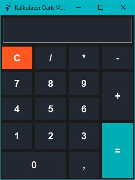

# 🧮 Kalkulator Dark Mode

Kalkulator sederhana dengan **Tkinter** dan tema **Dark Mode**.  
Mendukung input angka dengan pemisah ribuan (`1.000.000`) dan operasi dasar matematika.

## 📷 Screenshot


## 🚀 Cara Menjalankan
```bash
python kalkulator.py
